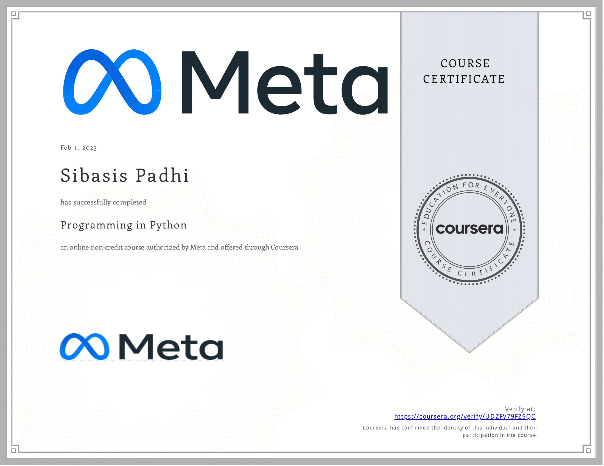

# Programming in Python

- This directory contains all of my assignments from the Coursera Course: [Programming in Python](https://www.coursera.org/learn/programming-in-python?specialization=meta-back-end-developer)

## Proof of Completion

