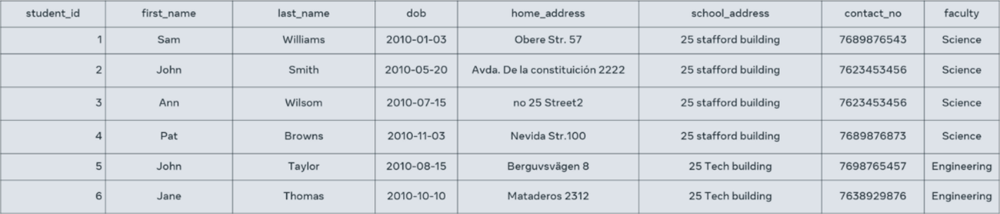

# Tables overview

A table is the most basic type of database object in relational databases. It is responsible for storing data in the database. Like any other table, a database table also consists of rows and columns. 

Just like in a spreadsheet of data, there are rows that run horizontally. These rows represent each record. Rows in turn span multiple columns. 

Columns run vertically. They are like the definition of each field. Each column has a name that describes the data that is stored in it.

Where the row intersects with a column is where a cell is located. A cell is where you store an item of data.

## What are data types?

Every column in a table has a data type. These data types are defined by SQL or Structured Query Language. A data type defines the type of value that can be stored in a table column. 

For example, here are some of the data types that are available:

- Numeric data types such as INT, TINYINT, BIGINT, FLOAT, REAL. 

- Date and time data types such as DATE, TIME, DATETIME. 

- Character and string data types such as CHAR, VARCHAR. 

- Binary data types such as BINARY, VARBINARY. 

- Miscellaneous data types such as: 

    - Character Large Object (CLOB) for storing a large block of text in some form of text encoding.   

    - Binary Large Object (BLOB) for storing a collection of binary data such as images. 

Here’s an example of a table. This is the student table that stores data about a student such as:

- student ID

- first name

- last name

- date of birth

- home address

- faculty

These are the table's columns. 

There are also six rows within this table; one for each student. In other words, the table contains the records of six students.

Each cell in a row or record contains a piece of data such as student ID = 1, first name = Emily, last name = Williams and so on.

The student ID would probably have a data type of INT, for example. First name and last name would have a data type of VARCHAR and date of birth would have a data type of DATE.

## Tables in a relational database

In a relational database there are multiple tables representing the structure of the back end of a software system. For example, in the context of a Student Information System, the tables might include Student, Teacher, Class and Subject.

In relational database terminology a table is also known as a relation. A table row or a record is also known as a tuple. For example, the student relation above has six tuples.

Each table or relation in a database has its own schema. Schema simply means the structure. The structure includes:

- the name of the table or relation

- its attributes

- their names  

- data type

## What is a primary key?

In a table, there is a field or column that is known as a key which can uniquely identify a particular tuple (row) in a relation (table). This key is specifically known as a primary key.

For example, in the student table, the student ID allows you to uniquely identify a particular row. The other columns like first name, last name, date of birth and others could contain duplicate or repeating data for multiple students. Therefore, they can't be used to uniquely identify a given student record. So, the student ID is the primary key of the student table.

In some cases, the primary key can comprise more than one column or field. This happens when a single column cannot make a record in a table uniquely identifiable. For example, in the table below, the EMP_ID values aren’t unique, so the column is not unique by itself. Thus, this column alone cannot be used as the primary key of this table. However, the EMP_ID and DEPT_ID columns together can make a record unique. Therefore, the primary key of this table is EMP_ID and DEPT_ID. This is also known as a composite primary key.

## What is a foreign key?

Tables in a database do not stay isolated from each other. They need to have relationships between them. Tables are linked with one another through a key column (the primary key) of one table that’s also present in the related table as a foreign key. For example, the student table and the department table are linked via the student ID which is the primary key of the student table that’s also present in the Department table as a foreign key.   

## Integrity constraints

Every table in a database should abide by rules or constraints. These are known as integrity constraints.

There are three main integrity constraints:

1. Key constraints

2. Domain constraints

3. Referential integrity constraints

## What are key constraints?

In every table there should be one or more columns or fields that can be used to fetch data from tables. In other words, a primary key. The key constraint specifies that there should be a column, or columns, in a table that can be used to fetch data for any row. This key attribute or primary key should never be NULL or the same for two different rows of data. For example, in the student table I can use the student ID to fetch data for each of the students. No value of student ID is null, and it is unique for every row, hence it can be the key attribute.

## What are domain constraints?

Domain constraints refer to the rules defined for the values that can be stored for a certain column. For instance, you cannot store the home address of a student in the first name column. Similarly, a contact number cannot exceed ten digits.

## What are referential integrity constraints?

When a table is related to another table via a foreign key column, then the referenced column value must exist in the other table. This means, according to the student and department examples, that values should exist in the student ID column in the student table because the two tables are related via the student ID column.

In this reading, you learned more about tables in a relational database as you explored the table in terms of its structure, data types, constraints, and the role of primary and foreign keys. 