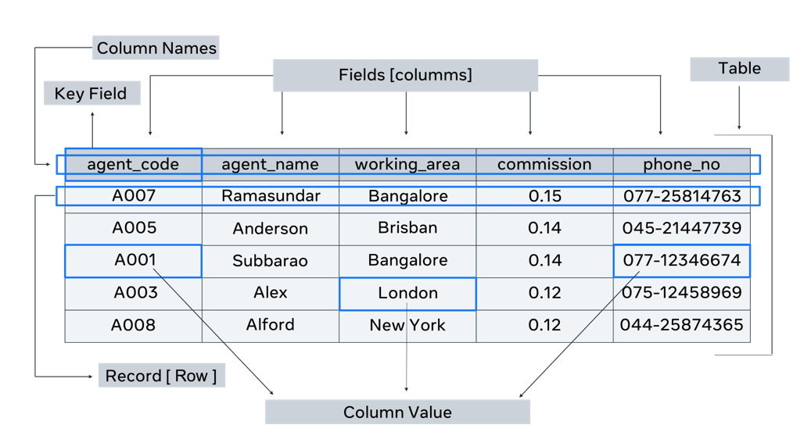
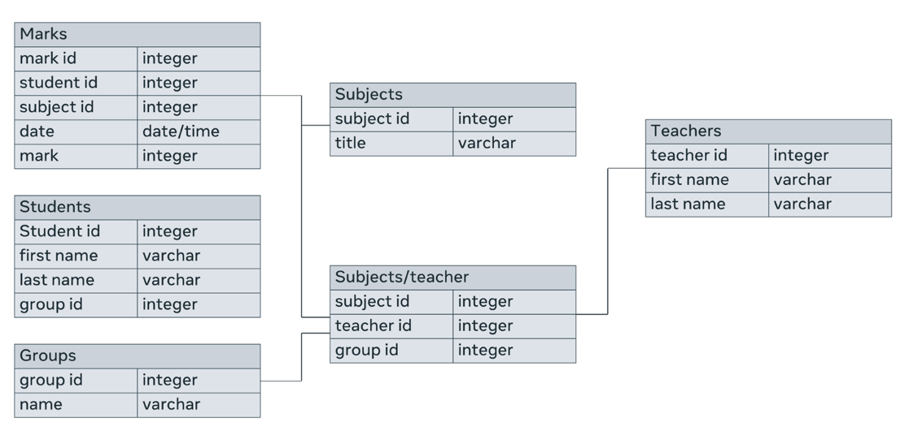
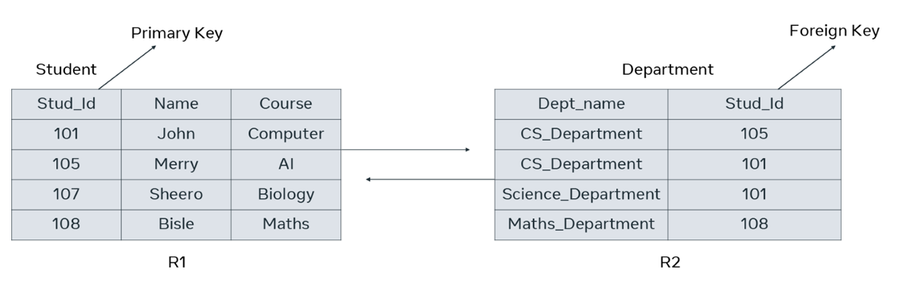

# Database structure overview

## What is database structure?

Database structure refers to how data is arranged in a database. Within a database, related data are grouped into tables, each of which consists of rows (also called tuples) and columns, like in a spreadsheet.

The structure of a database consists of a set of key components. These include:      

- __Tables__ or __entities__, where the data is stored. 

- __Attributes__ which are details about the table or entity. In other words, attributes describe the table.  

- __Fields__, which are columns used to capture attributes. 

- A __record__, which is one row of details about a table or entity. 

- And the __primary key__, which is a unique value for an entity. 

This image shows the basic structural elements of a database table.

## Table

A table contains all the fields, attributes and records for a type of entity. A database will most probably contain more than one table.

## Fields

Column headings are known as fields. Each field contains a different attribute. For every table, a unit of data is entered into each field. It’s also known as a column value. Each column has a data type. For example, the “agent_name” column has a data type of text, and the “commission” column has a numeric data type.

## Column value or unit of data

Each individual piece of data entered into a column is a unit of data. These units are also called data elements or column values.

## Records

A record consists of a collection of data for each entity. It’s also known as a row in the table.

## Data types

To keep the data consistent from one record to the next, an appropriate data type is assigned to each column. The data type of a column determines what type of data can be stored in each column.

Data types are also a way of classifying data values or column values. Different kinds of data values or column values require different amounts of memory to store them. Different operations can be performed on those column values based on their datatypes.

Some common data types used in databases are:

- Numeric data types such as INT, TINYINT, BIGINT, FLOAT and REAL. 

- Date and time data types such as DATE, TIME and DATETIME. 

- Character and string data types such as CHAR and VARCHAR.

- Binary data types such as BINARY and VARBINARY. 

- And miscellaneous data types such as: 

    - Character Large Object (CLOB), for storing a large block of text in some form of text encoding.  

    - and Binary Large Object (BLOB), for storing a collection of binary data such as images. 

## Logical database structure

The logical structure of a database is represented using a diagram known as the Entity Relationship Diagram (ERD). It is a visual representation of how the database will be implemented into tables during physical database design, using a Database Management System (DBMS) like MySQL or Oracle, for example. 

A part of the logical database structure is how relationships are established between entities. These relationships are established between the instances of the entities. Accordingly, there can be three ways in which entity instances can be related to each other:

- One-to-one relationships 

- One-to-many relationships 

- Many-to-many relationships 

This is also known as cardinality of relationships. The logical database structure which is represented using an ERD also depicts these relationships.

Here’s an example of an ERD that has all these elements.

## Physical database structure

In the physical database structure, where entities are implemented as tables, the relationships are established using a field known as a foreign key. A foreign key is a field in one table that refers to a common field in another table (usually the primary key). 

Let’s take the example of a database that contains two tables: student and department. The student table has a primary key of “Stud_id”, which is also present in the Department table as a foreign key. Therefore, the two tables are related to each other via the “Stud_id” field.

