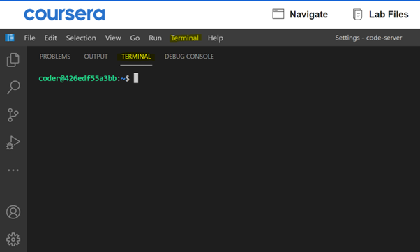
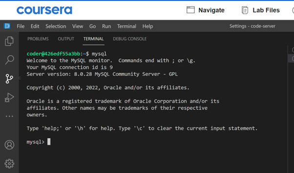
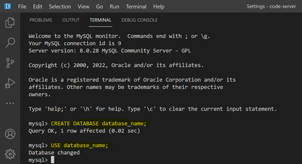

 ### **Tips: Before you Begin**
> - To view this file in Preview mode, right click on this README.md file and `Open Preview`

<br>
<br>

# A: Accessing MySQL terminal on Coursera platform  

To complete the labs you need to get access to the MySQL environment on Coursera platform. 

<br>
* In the course web page on Coursera, you need to click the open lab button. 


<br>

* You will be redirected to a new web page on the Coursera platform as displayed below. Click on the Terminal tab. 



<br>

* Inside the terminal section, type mysql keyword with a semicolon
```SQL 
mysql;
```

 Click enter. 
<br>

This will give you access to the MySQL environment, where you can start creating your database and tables. The image below confirms that MySQL is ready to use on the Coursera platform.



 <br><br> 
 
# B: Creating and using a new database in MySQL terminal on Coursera platform. 

The syntax to create a database and use it is as follows (remember to change the DB_NAME to the actual database you want to create and use.) 

```SQL 
CREATE DATABASE DB_NAME;
```
Click enter

```SQL 
USE DB_NaME;
```
Click enter.



